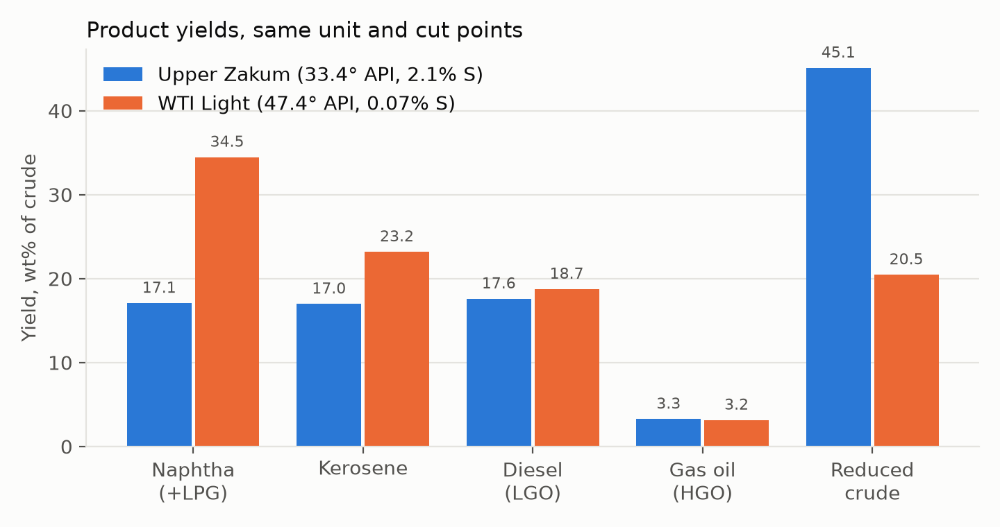
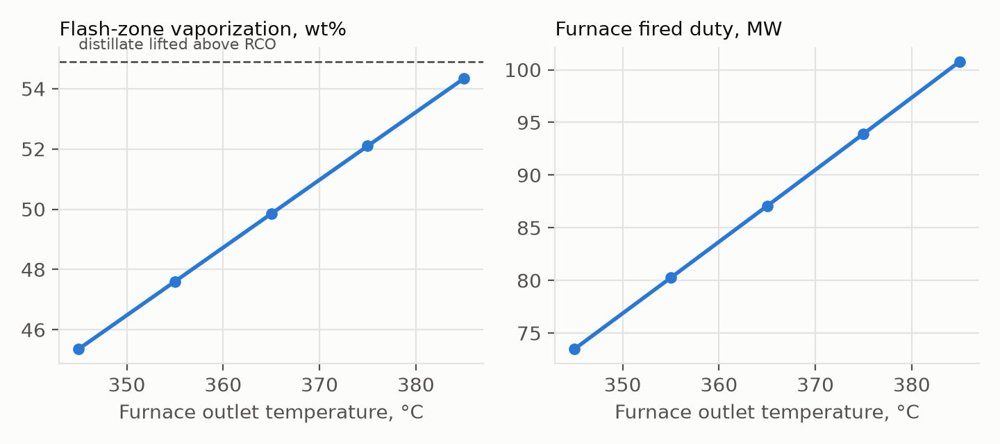
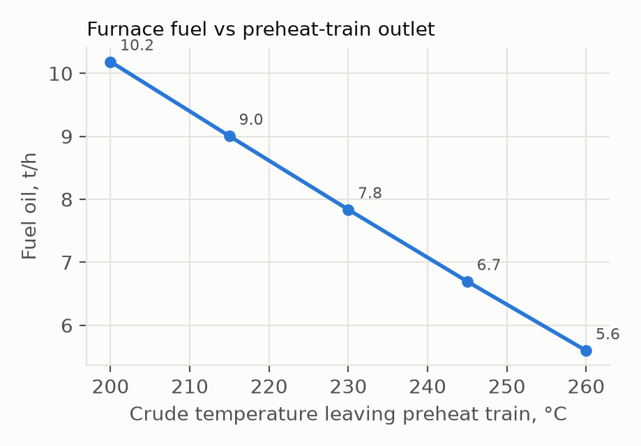

# Crude Distillation Unit Simulation in DWSIM (Upper Zakum vs WTI Light)

A 6 MMTPA (750 t/h) atmospheric crude unit modelled in DWSIM 9.0.5, driven from Python,
using public crude assays for a medium sour Middle East crude (Upper Zakum, Abu Dhabi,
33.4° API, 2.09 wt% S) and a light sweet crude (WTI Light, 47.4° API, 0.07 wt% S).

## 1. Crude characterization (`scripts/assay.py`, `characterize.py`, `model.py`)

- Assay TBP curve (wt%, 96 points to 700 °C) split into **6 real light ends (C2–nC5) + 25
  pseudo-components**, with cut boundaries aligned to the assay's cut table so every
  pseudo sits inside one assay cut.
- SG from each assay cut's Watson K, then scaled so every cut's 15 °C density is reproduced
  exactly. The >700 °C lump's NBP comes from the 550 °C+ volume-average boiling point.
- Pseudo properties use the same correlations as DWSIM's own characterization wizard
  (verified to 6 significant figures against a DWSIM-generated pseudo): Winn MW,
  Riazi–Daubert Tc/Pc, Lee–Kesler acentric factor, Abbott viscosities.
- Thermodynamics: Peng–Robinson.

| Check | Upper Zakum | WTI Light |
|---|---|---|
| Mass balance | 100.00 wt% | 100.00 wt% |
| Sulfur, model vs assay | 2.094 vs 2.095 wt% | 0.070 vs 0.070 wt% |
| Crude density, DWSIM vs assay | 852.0 vs 857.7 kg/m³ (−0.7%) | 781.2 vs 790.6 kg/m³ (−1.2%) |
| Psat of every pseudo at its NBP | 101,325 Pa | 101,325 Pa |

DWSIM's default Rackett liquid density under-predicted the crude by ~10% (its mixing rule
fails for wide-boiling mixtures). Fixed with a **per-component Peneloux volume translation
tuned to each pseudo's 15 °C density**.

## 2. Flowsheet (`scripts/fug.py`)

```
CRUDE 30 °C → E-101 preheat train (230 °C) → V-101 preflash drum (3.5 bar)
   liquid → F-101 furnace (COT 365 °C, 2.4 bar) ─┐
   vapour ───────────────────────────────────────┴→ flash zone
→ C-1 (RCO | 370 °C) → C-2 (HGO | 350 °C) → C-3 (LGO | 250 °C) → C-4 (KERO | 150 °C) → naphtha + LPG
```

The front end (preheat, preflash, furnace, flash zone) is rigorous. The fractionation is
a train of DWSIM shortcut columns (Fenske–Underwood–Gilliland) with adjacent-pseudo
keys at each TBP cut point, key impurity 1 mol%, and R = max(1.3 Rmin, 0.25).

**Limitation, stated plainly:** a single rigorous steam-stripped column with side draws
(`scripts/cdu.py`) did not converge in DWSIM. An 8.8.3 bug (unguarded `result(11)` in
the nested-loops PV flash, fixed in 9.x) was found in the source and removed by upgrading.
After that, the Wang–Henke and Naphtali–Sandholm solvers still diverged on the
ethane-to-740 °C feed. So the FUG train gives yields, cut quality and stage counts; its
condenser/reboiler duties are **not** representative of a real crude unit (which strips
with steam, not reboilers) and are not reported. Energy results come from the rigorous
front end only.

## 3. Base case, Upper Zakum (`results/results.json`)

| Product | Yield wt% | API | S wt% | TBP 5–95 °C | D86 T10–T90 °C |
|---|---|---|---|---|---|
| Naphtha + LPG | 17.1 | 77.3 | 0.027 | −10 to 152 | 21 to 132 |
| Kerosene | 17.0 | 46.2 | 0.19 | 147 to 256 | 174 to 235 |
| Diesel (LGO) | 17.6 | 33.9 | 1.14 | 248 to 357 | 270 to 334 |
| Gas oil (HGO) | 3.3 | 26.8 | 2.02 | 341 to 403 | 349 to 380 |
| Reduced crude | 45.1 | 13.8 | 3.97 | 385 to 740 | 400 to 686 |

- **Fractionation overlaps (TBP 5–95):** naphtha/kero −4.8 °C, kero/LGO −8.6 °C,
  LGO/HGO −16.1 °C, HGO/RCO −18.9 °C.
- **Theoretical stages at R = 1.3 Rmin (floor 0.25):** 18.5 / 7.0 / 8.6 / 15.3 for C-1 to C-4.
- **Energy:** preheat train 101.9 MW. Furnace absorbed 76.6 MW, fired 87.1 MW at 88%
  efficiency, which is **7.8 t/h fuel oil, 1.04% of crude**.
- **Straight-run diesel carries 1.14 wt% S** (11,400 ppm). Meeting the 10 ppm BS-VI
  limit is the DHDT's job, and it's the headline difference between the two crudes.

## 4. Studies



**Crude switch (same unit, same cut points).** WTI Light doubles naphtha (17.1 → 34.5 wt%)
and more than halves reduced crude (45.1 → 20.5 wt%). Diesel sulfur drops from 1.14% to
0.069%. The preflash takes 43% of the crude overhead (vs 17%), so fired duty falls from
87.1 to 67.8 MW, but the preheat train has to supply 16 MW more.



**Furnace outlet temperature.** Each +10 °C of COT buys ~2.2 wt% more flash-zone
vaporization for ~6.8 MW more fired duty. With the preflash vapour bypassing the furnace,
the flash zone at 365 °C is only 49.8 wt% vaporized against the 54.9 wt% that must leave
above the RCO. Even 385 °C reaches only 54.3%, so **stripping steam is required**, not
optional, in this configuration. (A direct flash showed ~0.9 wt% steam adds ~2 wt% of
vaporization.)



**Heat recovery.** Every 15 °C of extra preheat-train recovery saves ~1.15 t/h of fuel.
That's ~9,200 t/yr of fuel oil at 8,000 h/yr, or roughly 28,000 t/yr of CO₂ at 3.1 t CO₂/t fuel.

## 5. Files

- `results/CDU_upper_zakum.dwxmz`, `results/CDU_wti_light.dwxmz`: flowsheets, open in DWSIM 9.
- `results/results.json`: every number in this report.
- `scripts/run_study.py`: rebuilds everything (≈100 s); `make_figures.py` redraws the charts.
- `scripts/cdu.py`: the single rigorous-column attempt described above, kept for reference.

## 6. Reproduce

Windows, Python 3.12, [DWSIM 9.0.5](https://github.com/DanWBR/dwsim/releases) (per-user install
in `%LOCALAPPDATA%\DWSIM`, or set `DWSIM_PATH`).

```
pip install -r requirements.txt
cd scripts
python fetch_assays.py     # downloads the two public crude assays into data/
python run_study.py        # base cases + studies -> results/
python make_figures.py     # -> figures/
```

The assay workbooks are third-party public data and are not redistributed here;
`fetch_assays.py` downloads them from the publisher's public assay library.
